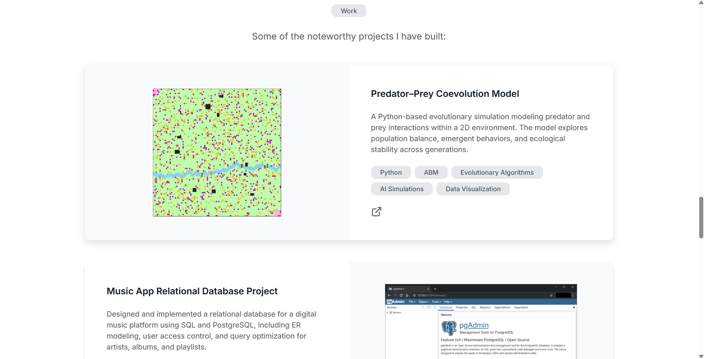

# Portfolio - Web Systems
**By Beatriz Albiac**

### Overview:
This is a project of a portfolio codded only using **HTML** and **CSS**. The prompt was to base the web on a figma desing trying to get it to be as close as posible but while coding everything.
However, it also can be used as a functional portfolio, as it has every section that could be relevant for an employer.

#### The main requirements were the following:
- Translate a Figma design into a static website using HTML and CSS.
- Apply responsive design principles.
- Organize and document a small front-end codebase with clear structure and naming.
- Deploy a static website.

## Links of interest:
figma design: https://www.figma.com/design/P5SVh2hIwbh7t3cOaQZjEO/Personal-Portfolio-Website-Template-%7C-Mobile---Desktop--Community-?node-id=328-4104&t=rJe60AMAqNFo7mO6-0

github repository link: https://github.com/beatrizalbiac/portfolio-web-systems

hosting url: https://portfolio-bad.web.app

#### Dimensions:
- desktop >= 1024px
- 1024 > tablet >= 789px *(not implemented)*
- mobile < 789px *(it's recomended to use 375px so it's as true to the figma design as possible)*

## Some screenshots as preview:
**Desktop:**

**Mobile:**

